# Aplicação dos conceitos de POO

Aplicação didática para demonstrar conceitos de programação orientada a objetos com TypeScript por meio de uma API REST em memória. O projeto foi simplificado para manter o foco nos principais elementos de POO e implementa três estruturas lineares genéricas:

- pilha
- fila
- lista

Ao longo da implementação, são utilizados:

- classes
- classes abstratas
- interfaces
- herança
- polimorfismo
- encapsulamento com `public`, `protected` e `private`
- membro `static`
- classe genérica

## Visão geral

A API expõe rotas em `/api` para manipular estruturas lineares e consultar estatísticas das instâncias criadas durante a execução.

As estruturas são mantidas em memória. Isso significa que os dados são perdidos quando a aplicação é reiniciada.

Para deixar o projeto mais fácil de estudar, os controllers acessam diretamente instâncias compartilhadas das estruturas em `src/models/instances.ts`, sem uma camada intermediária de serviços.

## Tecnologias

- Node.js
- TypeScript
- Express
- dotenv

## Organização do projeto

- `src/models`: classes base e estruturas de dados (`LinearStructure`, `Stack`, `Queue`, `ListStructure`)
- `src/models/interfaces`: contrato principal das estruturas (`ILinearStructure`)
- `src/models/instances.ts`: instâncias compartilhadas de pilha, fila e lista
- `src/controllers`: camada responsável por tratar requisições e respostas HTTP
- `src/routes`: definição das rotas da API
- `src/server.ts`: inicialização do servidor Express e carregamento das variáveis de ambiente

## Como executar

1. Instale as dependências:

```bash
npm install
```

2. Crie um arquivo `.env` na raiz do projeto, se quiser definir a porta:

```env
PORT=3001
```

3. Inicie em modo de desenvolvimento:

```bash
npm run dev
```

4. Ou gere o build e execute a versão compilada:

```bash
npm start
```

Se a variável `PORT` não estiver definida, a aplicação será executada em `http://localhost:3000`.

Os exemplos com `curl` abaixo assumem que a aplicação foi iniciada com `PORT=3001`.

## Conceitos de POO no projeto

- Classe: `Stack`, `Queue` e `ListStructure` representam implementações concretas de estruturas lineares.
- Interface: `ILinearStructure` define o contrato comum que todas as estruturas devem seguir.
- Classe abstrata: `LinearStructure` concentra comportamento compartilhado e impede instanciação direta.
- Herança: `Stack`, `Queue` e `ListStructure` estendem `LinearStructure`.
- Polimorfismo: as três estruturas compartilham a mesma interface pública (`add`, `remove`, `peek`, `getItems`, `getSize`, `clear`), mas cada uma implementa comportamentos próprios para remoção e consulta.
- Encapsulamento: o projeto utiliza `private`, `protected` e `public` para controlar acesso ao estado interno.
- `static`: `LinearStructure.getCreatedStructures()` contabiliza quantas estruturas foram instanciadas.
- Classe genérica: as estruturas usam `<T>` para armazenar qualquer tipo de dado.

## Propriedades e métodos

### `ILinearStructure<T>`

Propriedade:

- `name`: nome público da estrutura.

Métodos:

- `add(item: T)`: adiciona um item na estrutura.
- `remove()`: remove um item segundo a regra da estrutura concreta.
- `peek()`: consulta o item que seria removido primeiro, sem removê-lo.
- `getItems()`: retorna uma cópia dos itens armazenados.
- `getSize()`: retorna a quantidade de itens.
- `clear()`: remove todos os itens.
- `getId()`: retorna o identificador da estrutura.

### `LinearStructure<T>`

Propriedades:

- `createdStructures`: propriedade `private static` usada para contar quantas estruturas foram criadas.
- `id`: propriedade `private readonly` que guarda o identificador único da instância.
- `items`: propriedade `protected` que armazena internamente os elementos da estrutura.
- `name`: propriedade `public readonly` com o nome da estrutura.

Métodos:

- `constructor(name: string)`: define o nome da estrutura, incrementa o contador estático e gera o `id`.
- `add(item: T)`: adiciona um item ao array interno `items`.
- `remove()`: método abstrato; cada subclasse define como o item é removido.
- `peek()`: método abstrato; cada subclasse define qual item é consultado.
- `getItems()`: devolve uma cópia do array interno para evitar alteração externa direta.
- `getSize()`: informa o tamanho atual da estrutura.
- `clear()`: limpa todos os itens armazenados.
- `getId()`: retorna o identificador da instância.
- `getCreatedStructures()`: método `static` que retorna o total de estruturas criadas.

### `Stack<T>`

Métodos:

- `constructor(name = "Pilha")`: cria uma pilha com nome padrão ou personalizado.
- `remove()`: remove e retorna o item do topo da pilha com `pop()`.
- `peek()`: retorna o item do topo sem removê-lo.

### `Queue<T>`

Métodos:

- `constructor(name = "Fila")`: cria uma fila com nome padrão ou personalizado.
- `remove()`: remove e retorna o primeiro item da fila com `shift()`.
- `peek()`: retorna o primeiro item da fila sem removê-lo.

### `ListStructure<T>`

Métodos:

- `constructor(name = "Lista")`: cria uma lista com nome padrão ou personalizado.
- `remove()`: remove e retorna o último item da lista com `pop()`.
- `peek()`: retorna o último item da lista sem removê-lo.
- `getAt(index: number)`: retorna o item do índice informado ou `undefined` se o índice for inválido.
- `removeAt(index: number)`: remove e retorna o item do índice informado ou `undefined` se o índice for inválido.

### `src/models/instances.ts`

Propriedades exportadas:

- `stack`: instância compartilhada de `Stack<unknown>` usada pela API.
- `queue`: instância compartilhada de `Queue<unknown>` usada pela API.
- `list`: instância compartilhada de `ListStructure<unknown>` usada pela API.

## Endpoints

### Pilha

- `POST /api/pilha` adiciona um item ao topo da pilha
- `DELETE /api/pilha` remove o item do topo
- `GET /api/pilha/topo` consulta o item do topo
- `GET /api/pilha` lista os itens da estrutura
- `DELETE /api/pilha/limpar` remove todos os itens

Exemplos com `curl`:

```bash
curl -X POST http://localhost:3001/api/pilha \
  -H "Content-Type: application/json" \
  -d '{"item":"Livro"}'

curl -X GET http://localhost:3001/api/pilha

curl -X GET http://localhost:3001/api/pilha/topo

curl -X DELETE http://localhost:3001/api/pilha

curl -X DELETE http://localhost:3001/api/pilha/limpar
```

### Fila

- `POST /api/fila` adiciona um item ao final da fila
- `DELETE /api/fila` remove o item da frente
- `GET /api/fila/frente` consulta o item da frente
- `GET /api/fila` lista os itens da estrutura
- `DELETE /api/fila/limpar` remove todos os itens

Exemplos com `curl`:

```bash
curl -X POST http://localhost:3001/api/fila \
  -H "Content-Type: application/json" \
  -d '{"item":"Cliente 1"}'

curl -X GET http://localhost:3001/api/fila

curl -X GET http://localhost:3001/api/fila/frente

curl -X DELETE http://localhost:3001/api/fila

curl -X DELETE http://localhost:3001/api/fila/limpar
```

### Lista

- `POST /api/lista` adiciona um item ao final da lista
- `DELETE /api/lista` remove o último item
- `GET /api/lista/ultimo` consulta o último item
- `GET /api/lista` lista todos os itens
- `GET /api/lista/:index` consulta um item pelo índice
- `DELETE /api/lista/:index` remove um item pelo índice
- `DELETE /api/lista/limpar` remove todos os itens

Exemplos com `curl`:

```bash
curl -X POST http://localhost:3001/api/lista \
  -H "Content-Type: application/json" \
  -d '{"item":"Tarefa A"}'

curl -X GET http://localhost:3001/api/lista

curl -X GET http://localhost:3001/api/lista/ultimo

curl -X GET http://localhost:3001/api/lista/0

curl -X DELETE http://localhost:3001/api/lista

curl -X DELETE http://localhost:3001/api/lista/0

curl -X DELETE http://localhost:3001/api/lista/limpar
```

### Estatísticas

- `GET /api/estatisticas` retorna a quantidade total de estruturas criadas e o estado das instâncias em uso

Exemplo com `curl`:

```bash
curl -X GET http://localhost:3001/api/estatisticas
```


## Diagrama de classes

O diagrama abaixo resume os principais relacionamentos entre interface, classe abstrata, herança e uso das estruturas pelos controllers.

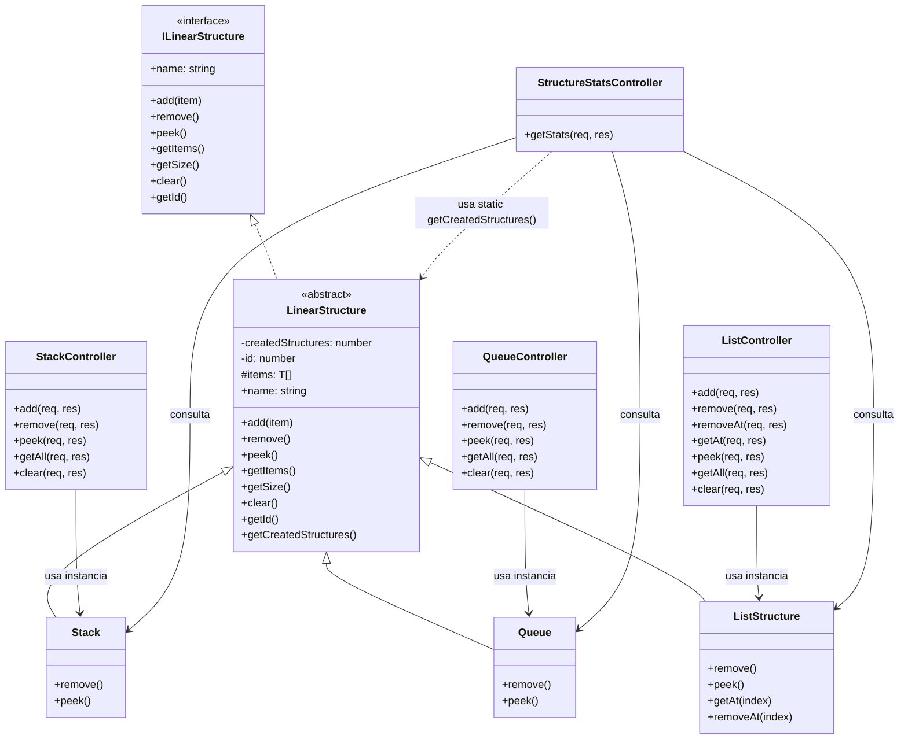
```mermaid
classDiagram
    class ILinearStructure {
        <<interface>>
        +name: string
        +add(item)
        +remove()
        +peek()
        +getItems()
        +getSize()
        +clear()
        +getId()
    }

    class LinearStructure {
        <<abstract>>
        -createdStructures: number
        -id: number
        #items: T[]
        +name: string
        +add(item)
        +remove()
        +peek()
        +getItems()
        +getSize()
        +clear()
        +getId()
        +getCreatedStructures()
    }

    class Stack {
        +remove()
        +peek()
    }

    class Queue {
        +remove()
        +peek()
    }

    class ListStructure {
        +remove()
        +peek()
        +getAt(index)
        +removeAt(index)
    }

    class StackController {
        +add(req, res)
        +remove(req, res)
        +peek(req, res)
        +getAll(req, res)
        +clear(req, res)
    }

    class QueueController {
        +add(req, res)
        +remove(req, res)
        +peek(req, res)
        +getAll(req, res)
        +clear(req, res)
    }

    class ListController {
        +add(req, res)
        +remove(req, res)
        +removeAt(req, res)
        +getAt(req, res)
        +peek(req, res)
        +getAll(req, res)
        +clear(req, res)
    }

    class StructureStatsController {
        +getStats(req, res)
    }

    ILinearStructure <|.. LinearStructure
    LinearStructure <|-- Stack
    LinearStructure <|-- Queue
    LinearStructure <|-- ListStructure

    StackController --> Stack : usa instancia
    QueueController --> Queue : usa instancia
    ListController --> ListStructure : usa instancia
    StructureStatsController --> Stack : consulta
    StructureStatsController --> Queue : consulta
    StructureStatsController --> ListStructure : consulta
    StructureStatsController ..> LinearStructure : usa static getCreatedStructures()
```

Observação: `T` representa o tipo genérico armazenado na estrutura.

## Diagramas de sequência por rota

### `POST /api/pilha`

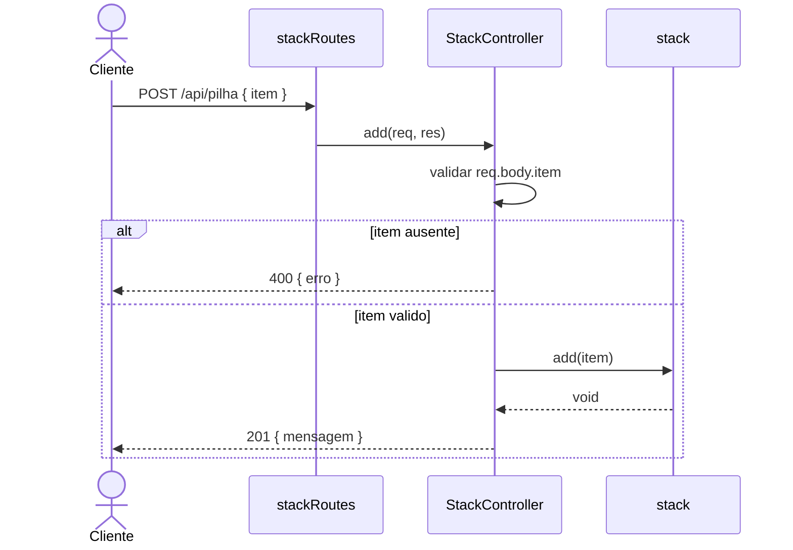
```mermaid
sequenceDiagram
    actor Cliente
    participant Router as stackRoutes
    participant Controller as StackController
    participant Structure as stack

    Cliente->>Router: POST /api/pilha { item }
    Router->>Controller: add(req, res)
    Controller->>Controller: validar req.body.item

    alt item ausente
        Controller-->>Cliente: 400 { erro }
    else item valido
        Controller->>Structure: add(item)
        Structure-->>Controller: void
        Controller-->>Cliente: 201 { mensagem }
    end
```

### `DELETE /api/pilha`

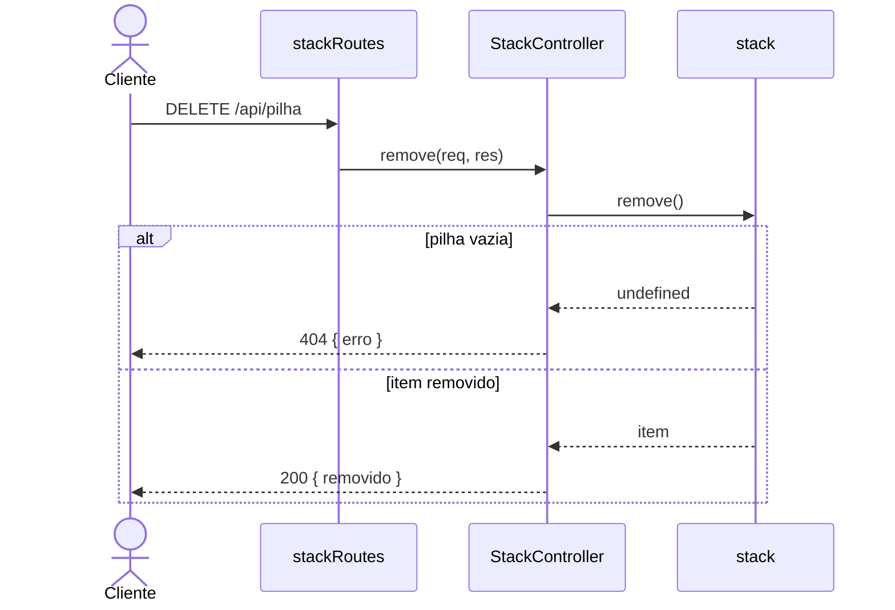
```mermaid
sequenceDiagram
    actor Cliente
    participant Router as stackRoutes
    participant Controller as StackController
    participant Structure as stack

    Cliente->>Router: DELETE /api/pilha
    Router->>Controller: remove(req, res)
    Controller->>Structure: remove()

    alt pilha vazia
        Structure-->>Controller: undefined
        Controller-->>Cliente: 404 { erro }
    else item removido
        Structure-->>Controller: item
        Controller-->>Cliente: 200 { removido }
    end
```

### `GET /api/pilha/topo`

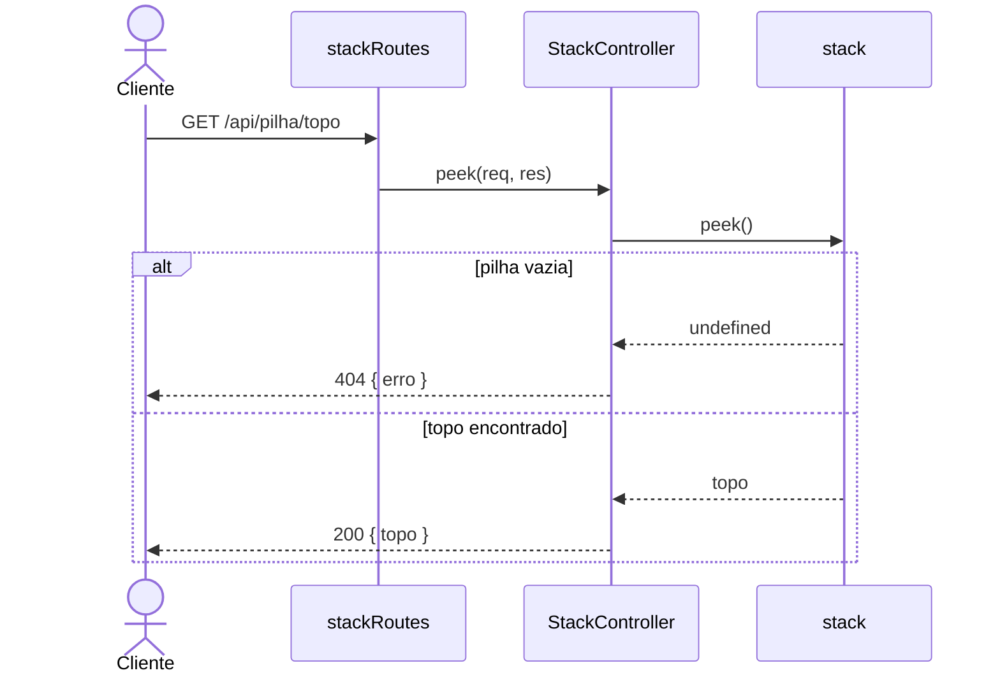
```mermaid
sequenceDiagram
    actor Cliente
    participant Router as stackRoutes
    participant Controller as StackController
    participant Structure as stack

    Cliente->>Router: GET /api/pilha/topo
    Router->>Controller: peek(req, res)
    Controller->>Structure: peek()

    alt pilha vazia
        Structure-->>Controller: undefined
        Controller-->>Cliente: 404 { erro }
    else topo encontrado
        Structure-->>Controller: topo
        Controller-->>Cliente: 200 { topo }
    end
```

### `GET /api/pilha`


```mermaid
sequenceDiagram
    actor Cliente
    participant Router as stackRoutes
    participant Controller as StackController
    participant Structure as stack

    Cliente->>Router: GET /api/pilha
    Router->>Controller: getAll(req, res)
    Controller->>Structure: getId(), getSize(), getItems()
    Structure-->>Controller: dados da pilha
    Controller-->>Cliente: 200 { estrutura, tamanho, itens }
```

### `DELETE /api/pilha/limpar`

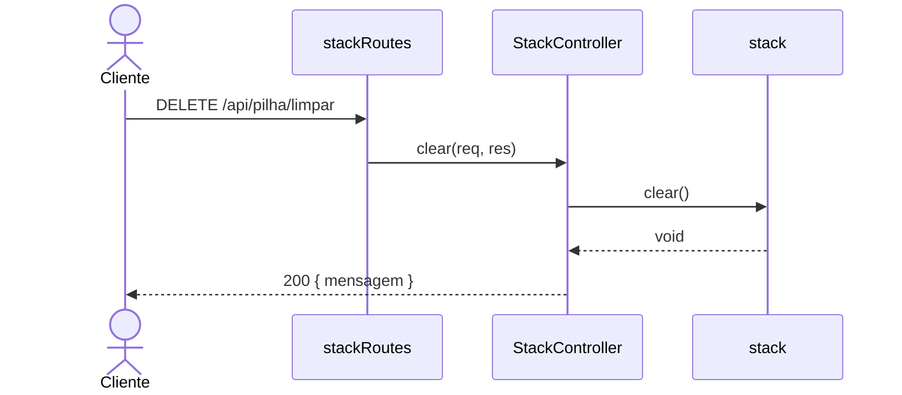
```mermaid
sequenceDiagram
    actor Cliente
    participant Router as stackRoutes
    participant Controller as StackController
    participant Structure as stack

    Cliente->>Router: DELETE /api/pilha/limpar
    Router->>Controller: clear(req, res)
    Controller->>Structure: clear()
    Structure-->>Controller: void
    Controller-->>Cliente: 200 { mensagem }
```

### `POST /api/fila`

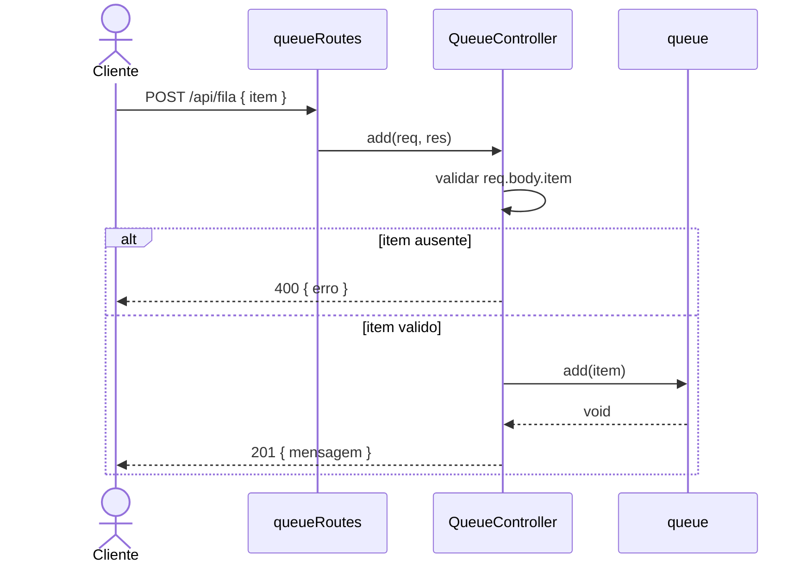
```mermaid
sequenceDiagram
    actor Cliente
    participant Router as queueRoutes
    participant Controller as QueueController
    participant Structure as queue

    Cliente->>Router: POST /api/fila { item }
    Router->>Controller: add(req, res)
    Controller->>Controller: validar req.body.item

    alt item ausente
        Controller-->>Cliente: 400 { erro }
    else item valido
        Controller->>Structure: add(item)
        Structure-->>Controller: void
        Controller-->>Cliente: 201 { mensagem }
    end
```

### `DELETE /api/fila`

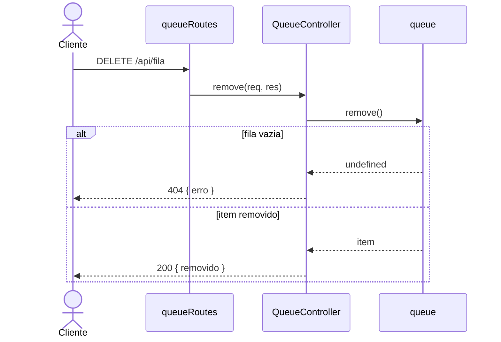
```mermaid
sequenceDiagram
    actor Cliente
    participant Router as queueRoutes
    participant Controller as QueueController
    participant Structure as queue

    Cliente->>Router: DELETE /api/fila
    Router->>Controller: remove(req, res)
    Controller->>Structure: remove()

    alt fila vazia
        Structure-->>Controller: undefined
        Controller-->>Cliente: 404 { erro }
    else item removido
        Structure-->>Controller: item
        Controller-->>Cliente: 200 { removido }
    end
```

### `GET /api/fila/frente`

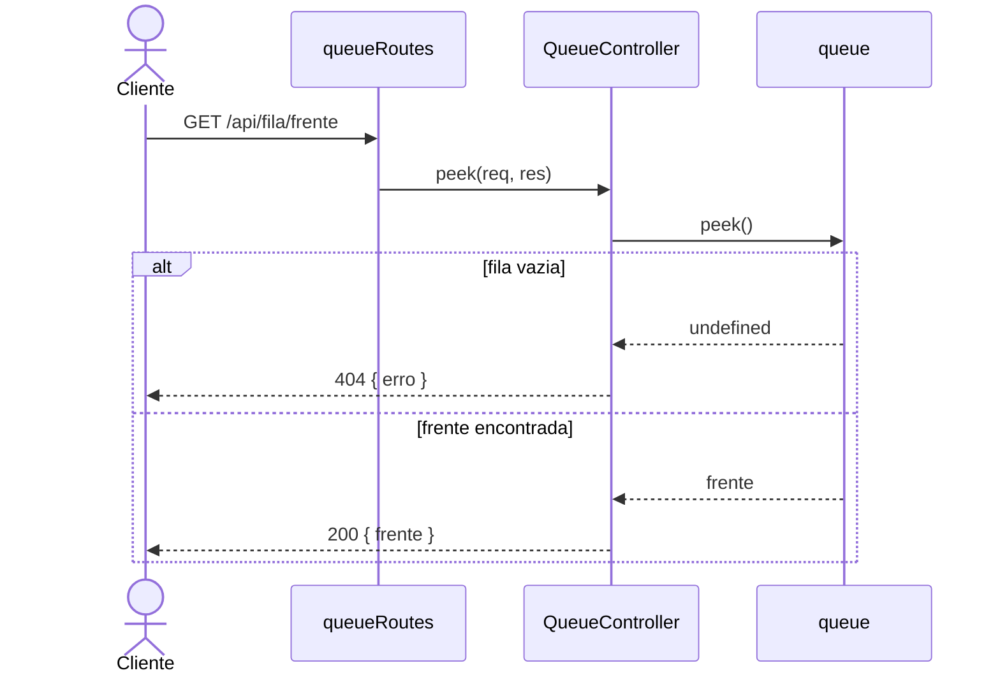
```mermaid
sequenceDiagram
    actor Cliente
    participant Router as queueRoutes
    participant Controller as QueueController
    participant Structure as queue

    Cliente->>Router: GET /api/fila/frente
    Router->>Controller: peek(req, res)
    Controller->>Structure: peek()

    alt fila vazia
        Structure-->>Controller: undefined
        Controller-->>Cliente: 404 { erro }
    else frente encontrada
        Structure-->>Controller: frente
        Controller-->>Cliente: 200 { frente }
    end
```

### `GET /api/fila`

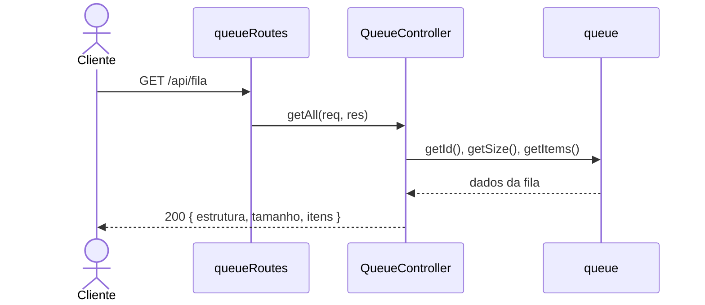
```mermaid
sequenceDiagram
    actor Cliente
    participant Router as queueRoutes
    participant Controller as QueueController
    participant Structure as queue

    Cliente->>Router: GET /api/fila
    Router->>Controller: getAll(req, res)
    Controller->>Structure: getId(), getSize(), getItems()
    Structure-->>Controller: dados da fila
    Controller-->>Cliente: 200 { estrutura, tamanho, itens }
```

### `DELETE /api/fila/limpar`

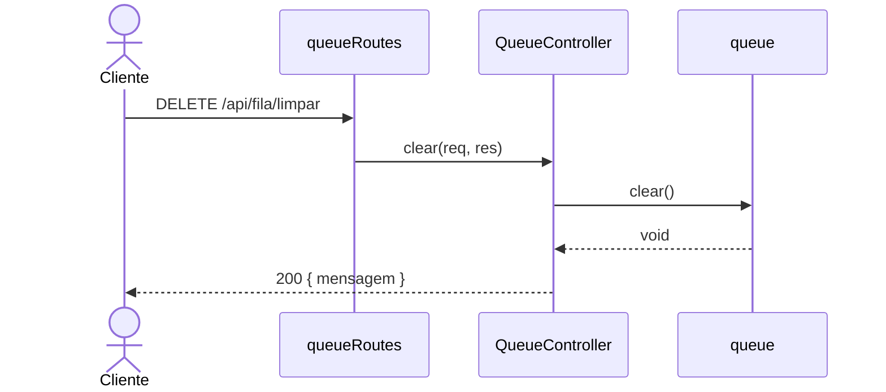
```mermaid
sequenceDiagram
    actor Cliente
    participant Router as queueRoutes
    participant Controller as QueueController
    participant Structure as queue

    Cliente->>Router: DELETE /api/fila/limpar
    Router->>Controller: clear(req, res)
    Controller->>Structure: clear()
    Structure-->>Controller: void
    Controller-->>Cliente: 200 { mensagem }
```

### `POST /api/lista`

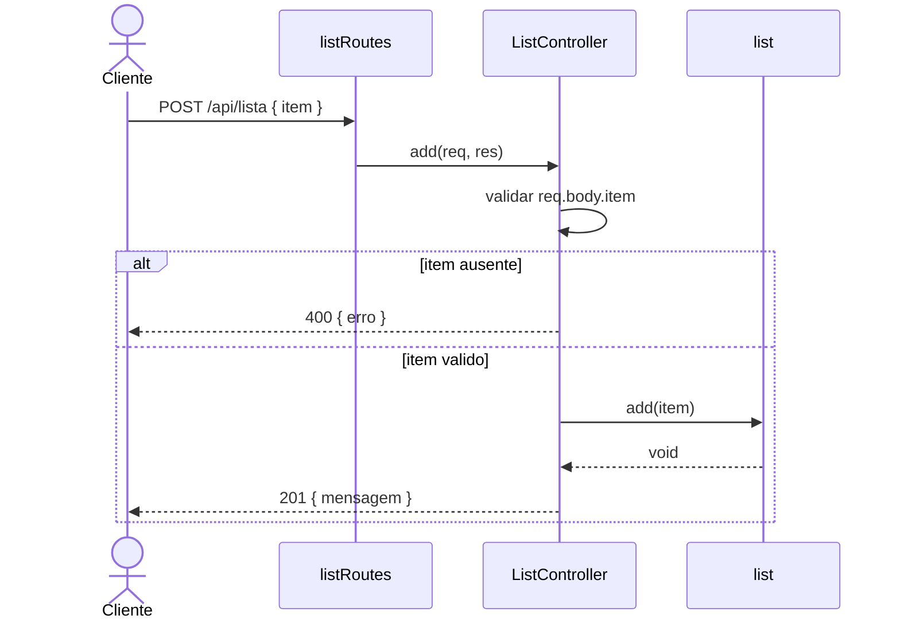
```mermaid
sequenceDiagram
    actor Cliente
    participant Router as listRoutes
    participant Controller as ListController
    participant Structure as list

    Cliente->>Router: POST /api/lista { item }
    Router->>Controller: add(req, res)
    Controller->>Controller: validar req.body.item

    alt item ausente
        Controller-->>Cliente: 400 { erro }
    else item valido
        Controller->>Structure: add(item)
        Structure-->>Controller: void
        Controller-->>Cliente: 201 { mensagem }
    end
```

### `DELETE /api/lista`

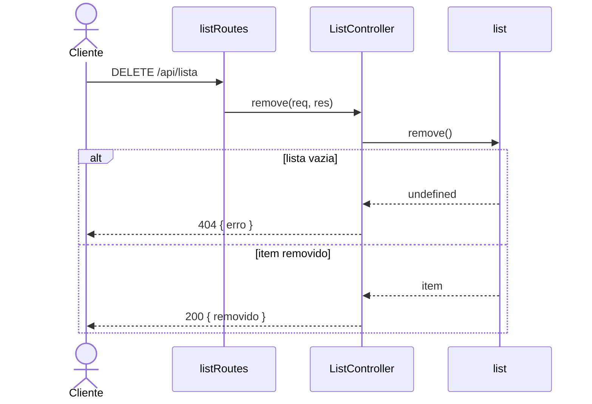
```mermaid
sequenceDiagram
    actor Cliente
    participant Router as listRoutes
    participant Controller as ListController
    participant Structure as list

    Cliente->>Router: DELETE /api/lista
    Router->>Controller: remove(req, res)
    Controller->>Structure: remove()

    alt lista vazia
        Structure-->>Controller: undefined
        Controller-->>Cliente: 404 { erro }
    else item removido
        Structure-->>Controller: item
        Controller-->>Cliente: 200 { removido }
    end
```

### `GET /api/lista/ultimo`

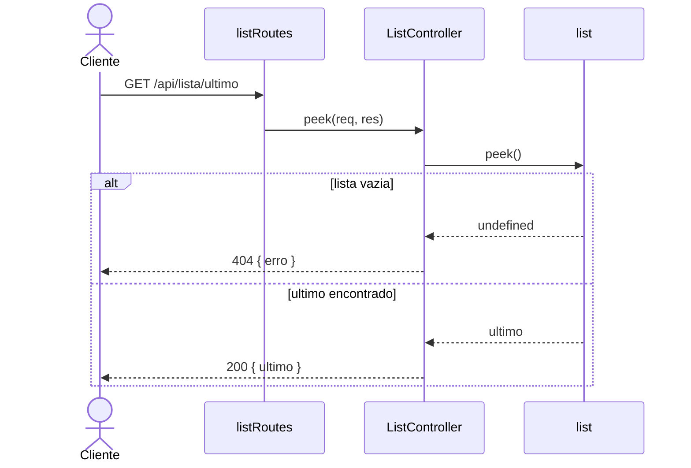
```mermaid
sequenceDiagram
    actor Cliente
    participant Router as listRoutes
    participant Controller as ListController
    participant Structure as list

    Cliente->>Router: GET /api/lista/ultimo
    Router->>Controller: peek(req, res)
    Controller->>Structure: peek()

    alt lista vazia
        Structure-->>Controller: undefined
        Controller-->>Cliente: 404 { erro }
    else ultimo encontrado
        Structure-->>Controller: ultimo
        Controller-->>Cliente: 200 { ultimo }
    end
```

### `GET /api/lista`


```mermaid
sequenceDiagram
    actor Cliente
    participant Router as listRoutes
    participant Controller as ListController
    participant Structure as list

    Cliente->>Router: GET /api/lista
    Router->>Controller: getAll(req, res)
    Controller->>Structure: getId(), getSize(), getItems()
    Structure-->>Controller: dados da lista
    Controller-->>Cliente: 200 { estrutura, tamanho, itens }
```

### `GET /api/lista/:index`

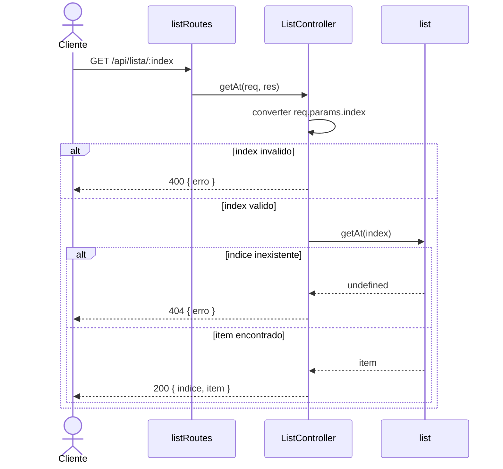
```mermaid
sequenceDiagram
    actor Cliente
    participant Router as listRoutes
    participant Controller as ListController
    participant Structure as list

    Cliente->>Router: GET /api/lista/:index
    Router->>Controller: getAt(req, res)
    Controller->>Controller: converter req.params.index

    alt index invalido
        Controller-->>Cliente: 400 { erro }
    else index valido
        Controller->>Structure: getAt(index)
        alt indice inexistente
            Structure-->>Controller: undefined
            Controller-->>Cliente: 404 { erro }
        else item encontrado
            Structure-->>Controller: item
            Controller-->>Cliente: 200 { indice, item }
        end
    end
```

### `DELETE /api/lista/:index`

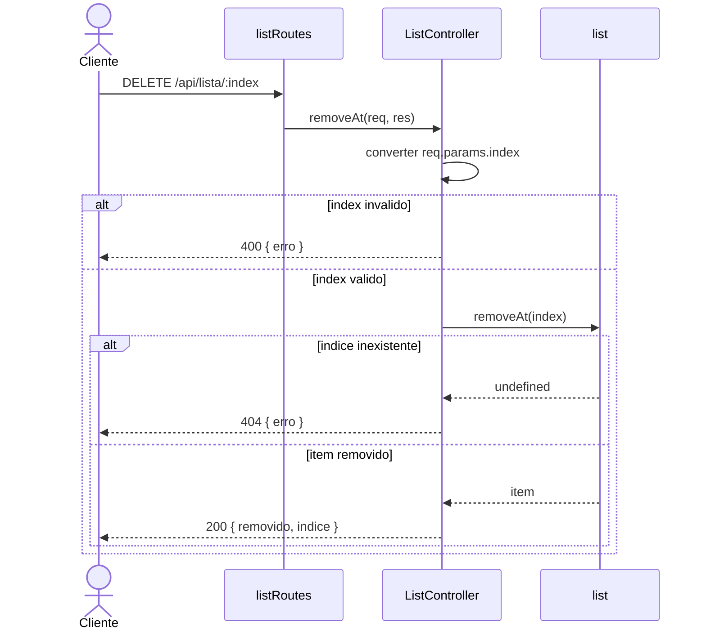
```mermaid
sequenceDiagram
    actor Cliente
    participant Router as listRoutes
    participant Controller as ListController
    participant Structure as list

    Cliente->>Router: DELETE /api/lista/:index
    Router->>Controller: removeAt(req, res)
    Controller->>Controller: converter req.params.index

    alt index invalido
        Controller-->>Cliente: 400 { erro }
    else index valido
        Controller->>Structure: removeAt(index)
        alt indice inexistente
            Structure-->>Controller: undefined
            Controller-->>Cliente: 404 { erro }
        else item removido
            Structure-->>Controller: item
            Controller-->>Cliente: 200 { removido, indice }
        end
    end
```

### `DELETE /api/lista/limpar`

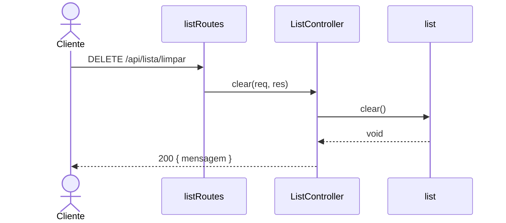
```mermaid
sequenceDiagram
    actor Cliente
    participant Router as listRoutes
    participant Controller as ListController
    participant Structure as list

    Cliente->>Router: DELETE /api/lista/limpar
    Router->>Controller: clear(req, res)
    Controller->>Structure: clear()
    Structure-->>Controller: void
    Controller-->>Cliente: 200 { mensagem }
```

### `GET /api/estatisticas`

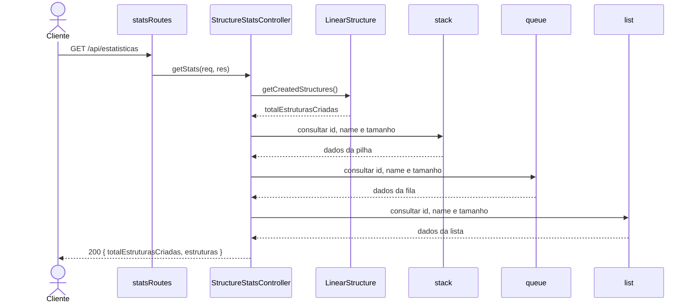
```mermaid
sequenceDiagram
    actor Cliente
    participant Router as statsRoutes
    participant Controller as StructureStatsController
    participant Base as LinearStructure
    participant Stack as stack
    participant Queue as queue
    participant List as list

    Cliente->>Router: GET /api/estatisticas
    Router->>Controller: getStats(req, res)
    Controller->>Base: getCreatedStructures()
    Base-->>Controller: totalEstruturasCriadas
    Controller->>Stack: consultar id, name e tamanho
    Stack-->>Controller: dados da pilha
    Controller->>Queue: consultar id, name e tamanho
    Queue-->>Controller: dados da fila
    Controller->>List: consultar id, name e tamanho
    List-->>Controller: dados da lista
    Controller-->>Cliente: 200 { totalEstruturasCriadas, estruturas }
```

## Observações finais

- `LinearStructure` controla, por meio de um atributo `static`, quantas estruturas foram instanciadas.
- As instâncias principais da aplicação ficam centralizadas em `src/models/instances.ts`.
- Os controllers manipulam diretamente essas instâncias para manter a arquitetura mais simples e didática.
- A rota `/api/estatisticas` usa esses metadados para consolidar informações sobre pilha, fila e lista.
